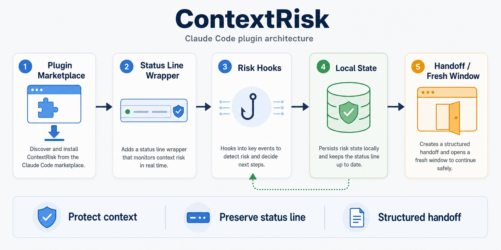
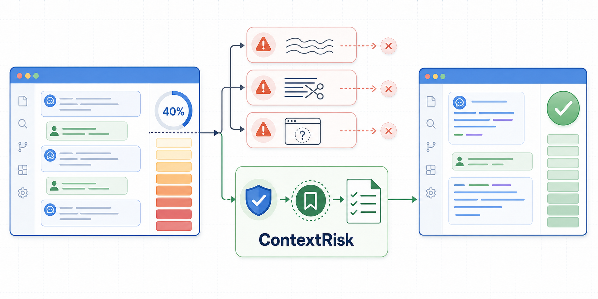

# ContextRisk

**语言：** [English](README.md) | 中文

ContextRisk 是一个 Claude Code 插件，用来观察上下文使用率，并在当前窗口到达 40%、50%、以及之后每 10% 阈值时自动生成结构化 handoff。它会保留你原有的状态栏，并给出 `/new` 加 `/context-risk:continue <handoff-id>` 的干净接力路径，但默认不拦截正常工作。

**仓库地址：** [SodaZheng/context-risk](https://github.com/SodaZheng/context-risk)



## 项目背景与目标

这个项目来自一个反复出现的工程实践问题：在长时间使用 Claude Code 或其他模型完成复杂任务时，上下文窗口并不是接近满载才开始变差。很多模型在上下文使用率超过约 40% 之后，约束保持、目标聚焦、代码路径记忆和风险判断都会开始下降。继续在同一个窗口里强行推进，往往不是效率更高，而是在累积更难发现的偏差。

现有的恢复方式也不够稳定。内置压缩可以减少上下文体积，但压缩内容和保留重点并不完全可控；直接新开一个窗口虽然上下文更干净，却很难准确描述已经完成了什么、哪些假设被验证过、当前应该从哪里继续，以及哪些历史约束不能丢失。

ContextRisk 的目标是把这类不可控的“上下文衰退”变成可观察、可提前处理、可交接的工作流问题。它不试图无限延长单个窗口，而是在风险升高时自动准备新的 handoff checkpoint，让新窗口基于可验证的任务状态继续。



## 它解决什么问题

长任务、调试、批量文件阅读和多代理协作很容易把上下文窗口推到高风险区域。一旦模型开始遗忘早期约束，继续硬做通常会带来错误判断、重复探索和难以恢复的状态漂移。

ContextRisk 的目标不是把完整对话塞进新窗口，而是把继续工作真正需要的事实、目标、待办、风险和验证证据整理成 handoff。它帮助你在上下文变差之前停下来，把任务交给一个上下文更干净的新窗口继续。

## 核心功能

### 上下文风险感知

ContextRisk 会读取 Claude Code 状态栏提供的上下文使用率，并记录最近一次观察到的风险状态。它会把 Claude Code hooks 当作传感器使用，当最近观察到的百分比跨过自动 handoff 阈值时生成新的 handoff。

默认自动 handoff 阈值：

| 阈值 | 提示 |
| --- | --- |
| 40% | 建议切到新窗口 |
| 50% | 建议尽快切到新窗口 |
| 60%、70%、80%、90% | 强烈建议切到新窗口 |

### 保留原有状态栏

安装时，ContextRisk 会包一层状态栏逻辑，同时保留你原来的状态栏输出和配置。你仍然看到原本的状态栏信息，ContextRisk 只额外记录上下文风险所需的本地状态。

如果插件更新后缓存路径变化，ContextRisk 会在新会话启动时通过 `SessionStart` 自动修复状态栏包装。通常不需要手动运行 `repair`；它只是强制刷新或排障时的兜底命令。

### 自动 handoff checkpoint

ContextRisk 会把 Claude Code hooks 当作传感器使用。当最近观察到的上下文使用率跨过 40%、50%、60%、70%、80% 或 90% 时，它会在 `.context-risk/handoffs/` 下生成一份新的 handoff，并提示：

```text
/new
/context-risk:continue <handoff-id>
```

默认行为是不拦截。ContextRisk 不会阻止 prompt、工具调用、子代理或压缩流程；它只负责提前准备更安全的接力点，由你决定什么时候切到新窗口。

### 结构化 handoff

当窗口到达自动 handoff 阈值，或者你主动希望换一个干净窗口继续时，ContextRisk 会生成 handoff。handoff 会聚合当前任务的核心信息：

- 当前目标
- 已完成工作
- 未完成待办
- 关键文件和项目状态
- 已验证事实与未验证假设
- 已知风险
- 推荐下一步
- 新窗口继续用的提示语

新窗口通过 handoff ID 继续时，ContextRisk 会读取项目里的 handoff 文件，核对当前目录和 git 状态，然后从可验证的信息恢复任务，而不是依赖旧窗口的长上下文记忆。

### 本地状态与隐私

ContextRisk 只写入本机和当前项目目录：

```text
~/.claude/context-risk/
  state.json
  events.jsonl
  original-statusline.json
  statusline-wrapper.mjs
```

```text
.context-risk/
  handoffs/
  compacts/
```

项目 handoff 默认应被 git 忽略，因为它们可能包含本地路径、任务状态、摘要或其他只适合本机使用的信息。分享 handoff 前请先审阅内容。

## 安装

### 从 GitHub marketplace 仓库安装

```text
/plugin marketplace add SodaZheng/context-risk
/plugin install context-risk@context-risk-marketplace
/context-risk:install
```

### 从本地 checkout 测试

```text
/plugin marketplace add /absolute/path/to/ContextRisk
/plugin install context-risk@context-risk-marketplace
/context-risk:install
```

`/context-risk:install` 会备份 `~/.claude/settings.json`，保存你原来的状态栏配置，并只更新 Claude Code 的 `statusLine.command`。

## 常用命令

| 命令 | 用途 |
| --- | --- |
| `/context-risk:install` | 安装状态栏包装，启用上下文风险记录。 |
| `/context-risk:repair` | 强制刷新状态栏包装；通常不需要，主要用于排障或立即修复。 |
| `/context-risk:uninstall` | 卸载 ContextRisk 并恢复原状态栏。 |
| `/context-risk:risk-check` | 查看最近的上下文状态和风险事件。 |
| `/context-risk:handoff` | 自动从完整对话中识别当前任务并生成结构化 handoff。 |
| `/context-risk:continue <handoff-id>` | 在新窗口中从指定 handoff 继续。 |
| `/context-risk:compact-plan` | 生成更安全的 `/compact` 指令。 |

## 推荐工作流

1. 正常使用 Claude Code 开发、调试或分析项目。
2. 当 ContextRisk 自动生成 handoff 时，决定现在切窗口还是短暂继续。
   你也可以随时直接运行不带参数的 `/context-risk:handoff`；它会从当前完整对话中
   自动整理目标、决策、已完成工作、待办、验证证据和风险。
3. 如果要切换，打开新的 Claude Code 窗口：

   ```text
   /new
   ```

4. 使用 ContextRisk 提示里的 handoff ID 继续：

   ```text
   /context-risk:continue <handoff-id>
   ```

5. 新窗口会核对项目状态、复述任务上下文，并从第一项未完成待办开始继续。

## 配置

ContextRisk 默认会在 40%、50%、60%、70%、80% 和 90% 自动生成 handoff。高级工作流调整由本地 auto-handoff 配置驱动。

高级本地覆盖可以写入：

```text
~/.claude/context-risk/config.json
```

示例：

```json
{
  "autoHandoff": {
    "enabled": true,
    "thresholds": [40, 50, 60, 70, 80, 90]
  }
}
```

建议先使用默认配置。只有当你的工作流确实需要更早或更晚的 handoff checkpoint 时，再调整本地覆盖。

## 更新、自动修复与卸载

更新 marketplace 后，通常只需要打开下一次 Claude Code 会话。ContextRisk 会通过 `SessionStart` hook 自动刷新状态栏包装，让它指向更新后的插件缓存路径。

只有在下面几种情况才需要手动运行 `repair`：

- 你刚更新完插件，想在当前会话里立即强制刷新。
- 自动修复没有生效，状态栏仍然指向旧插件缓存。
- `/context-risk:risk-check` 显示状态异常，需要排障。

```text
/context-risk:repair
```

卸载时先恢复状态栏，再卸载插件：

```text
/context-risk:uninstall
/plugin uninstall context-risk
```

## 排障

### 找不到插件

刷新 marketplace 后重新安装：

```text
/plugin marketplace update context-risk-marketplace
/plugin install context-risk@context-risk-marketplace
```

### hooks 有运行，但没有上下文使用率

先安装状态栏包装，再查看状态：

```text
/context-risk:install
/context-risk:risk-check
```

### 插件更新后状态栏异常

先打开一个新的 Claude Code 会话，让 `SessionStart` 自动修复运行一次。如果状态栏仍然异常，再运行：

```text
/context-risk:repair
```

### 想恢复旧状态栏

运行：

```text
/context-risk:uninstall
```

如果仍需手动检查，可以查看 `~/.claude/settings.json` 附近的备份文件。

## 开发与发布

ContextRisk 面向 marketplace 安装场景，用户不需要全局 CLI、构建产物或额外依赖。维护者在发布前应至少运行：

```bash
npm test
npm run verify
```

发布前请确认 marketplace 文件、插件 manifest、hooks 和 skills 都已提交，并在公开开源前补充 `LICENSE`。
